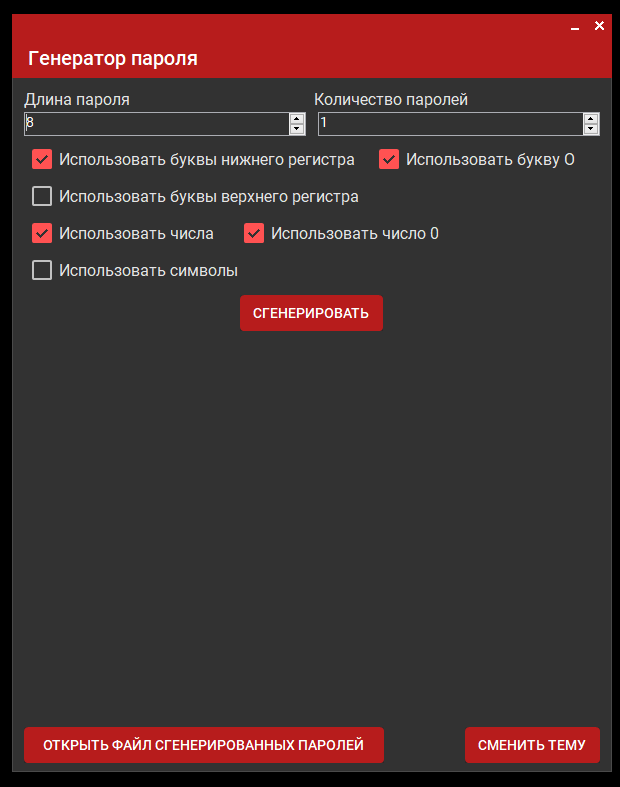

# Password-Project

Генератор паролей на платформе Windows Forms.

Этот простой генератор паролей предназначен для создания надежных паролей. Он также предоставляет возможность исключить использование числа "0" и буквы "О", если вы часто путаете их.

## О программе

Цель этого проекта - предоставить удобный интерфейс для генерации безопасных паролей, помогая пользователям повысить свою онлайн-безопасность, используя надежные и уникальные пароли для различных учетных записей.

## Установка

Просто скачайте или клонируйте репозиторий и откройте файл решения в Visual Studio. Оттуда вы можете создать и запустить проект.

## Особенности

- Простой и интуитивно понятный пользовательский интерфейс
- Возможность исключить вводящие в заблуждение символы
- Автоматическое сохранение сгенерированных паролей в определенном файле

Сгенерированные пароли сохраняются в файле, расположенном по следующему пути: `%APPDATA%/Result/Password-Generator/passwords.txt`

## В будущем

- Будет добавлена темная тема (Отменён)

---

Не забудьте сохранить свои сгенерированные пароли в безопасном месте! Рекомендуется использовать менеджеры паролей для управления вашей конфиденциальной информацией.
